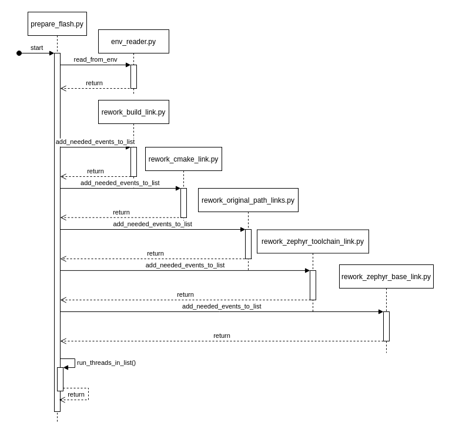

## Flash on Pi

Da der `build` prozess auf einem anderem System geschehen ist, muss der `flash` Prozess zunächst vorbereitet werden. Diese Vorbereitung beinhaltet einzelne Schritte, welche die Verlinkung zu bestimmten Pfaden abändert, sodass diese sich im Einklang mit dem System vom Pi verhalten. Die gebrauchten Pfade (Verlinkungen), die geändert werden müssen, können sich praktischerweise in einer Datei wiederfinden.

#### CMakeCache.txt

Diese Datei kann man fast als Informationsausgabe vom `build` Prozess bezeichnen. Sie beinhaltet viele verschiedene Informationen, welche unteranderem auch die Umgebung umfasst, in welcher der `build`  Prozess stattfand(generiert wird sie vom Tool: `cmake`). 

Die für uns wichtigsten Informationsteile zum vorbereiten des flash-prozesses sind folgende:

- ```ceylon
  // Application Binary Directory
  APPLICATION_BINARY_DIR:PATH=/home/user/zephyr/samples/basic/fade_led/build
  ```

- ```ceylon
  // Application Source Directory
  APPLICATION_SOURCE_DIR:PATH=/home/user/zephyr/samples/basic/fade_led
  ```

- ```ceylon
  //Path to CMake executable.
  CMAKE_COMMAND:INTERNAL=/usr/bin/cmake
  ```

- ```ceylon
  //Zephyr SDK install directory
  ZEPHYR_SDK_INSTALL_DIR:PATH=/home/user/zephyr-sdk-0.13.2
  ```

- ```ceylon
  //Zephyr base
  ZEPHYR_BASE:PATH=/home/user/zephyrproject/zephyr
  ```

#### Vorgang der Vorbereitung

Um das build-directory für den `flash` vorzubereiten, werden diese Informationsschnipsel in Zusammenarbeit mit dem gegeben Informationen aus der `.env` Datei genutzt, um Teile aus Dateien umzuschreiben.

Um das Umändern der Verlinkungen durchzuführen verwende ich eine kleine Menge an Python-Scripten.

```bash
- env_utils.py
- prepare_flash.py
- rework_build_link.py
- rework_cmake_link.py
- rework_original_path_links.py
- rework_zephyr_base_link.py
- rework_zephyr_toolchain_link.py
```

#### prepare_flash.py

Das Vorbereitungsscript (`prepare_flash.py`) beinhaltet den Startpunkt und durchgeht folgende Schritte:

1.  lesen der Konfigurationsdatei .env 
2.  Vorbereiten der gebrauchten Datei änderungen:
    1.  build link
    2.  cmake link
    3.  project path link
    4.  toolchain link
    5.  zephyr base link

3.  durchführen der gebrauchten Änderungen 



#### `rework` Scripts

Die `rework`-scripts haben alle im allgemeinen den selben Ablauf.


1. `get local link`

   - dieser Schritt kann entweder ganz einfach sein (dieser Wert wird schon mit als Parameter übergeben / er ist immer gleicht ), oder nutzt kleine System Calls (Bspw: `whereis cmake`)

   - ```python
     # returns the local cmake installation/call path
     def get_local_cmake_install():
         # command to be executed (command finds cmake installation path)
         command = ["whereis", "cmake"]
         # command execution with given output to console put in variable
         res = subprocess.check_output(command)
         # returns first found path
         return res.decode("utf-8").split(" ")[1]
     ```

2. `get link given in CMakeCache.txt`

   - Wie schon oben beschrieben, befinden sich alle gebrauchten Informationen um alle Dateien umzuschreiben in der `CMakeCache.txt` Datei. Um sie dort raus zu bekommen, muss die Datei Zeile für Zeile durchgangen und mit einem `regex`-Pattern abgeglichen werden. Wie die Daten in der Datei gelesen werden sollen, sagt uns Datei selber in den ersten Zeilen. 

   - ```bash
     # The syntax for the file is as follows:
     # KEY:TYPE=VALUE
     # KEY is the name of a variable in the cache.
     # TYPE is a hint to GUIs for the type of VALUE, DO NOT EDIT TYPE!.
     # VALUE is the current value for the KEY.
     ```

   - Von hier aus muss nun nur noch der `Key` zur gebrauchten `value` gesucht und gefunden werden.

   - ```python
     # returning the original dir where the build took place
     def get_original_cmake_install_dir(filepath):
         # Opening the file 
         with open(filepath, "r") as file:
             while True:
                 # Get next line from file
                 line = file.readline()
                  
                 # serach in the read line for the needed key
                 if re.search(key_to_search_for, line):
                     # clean the line from the key and any newlines and return it
                     return line.replace(key_to_search_for, "").replace("\n", "")
     
                 # if line is empty
                 # end of file is reached
                 if not line:
                     print("no original dir found")
                     exit(1)
     ```

3. `scan through all files in build path and get all needed files`

   - Dieser Scan ist sehr primitiv gehalten, kann jedoch in späterer Zeit noch verfeinert werden. Bisher geht er nur duch alle existenten Dateien durch,  merk sich jede mit lese und schreib rechten, und gibt diese zurück.

4. `add thread to list per file in need of change`
